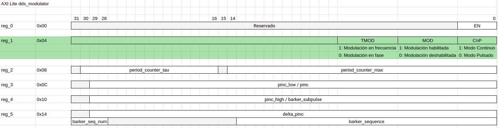

# TP4 - Testing de Software en Sistemas Embebidos

## Descripción del sistema a testear

En el bloque HAL (Hardware Abstraction Layer) del subsistema de software dentro del proyecto final, se pretende abstraer el acceso a una serie de registros presentes en la FPGA del SoC que se va a utilizar.

Los registros se mapean en memoria, y se acceden a través de un bus AXI.

El mapa de memoria de los registros es el siguiente:



### Los tests propuestos son los siguientes:

 * > Se puede leer el valor de un registro de 32 bits
 * > Se puede escribir a un registro de 32 bits
 * > Se puede escribir a un bit específico dentro de un registro
 * > Se puede leer el estado de un bit específico dentro de un registro
 * > Se puede conocer el estado de configuración leyendo a una estructura, el modo, la habilitación de modulación y el tipo de modulación
 * > Se puede configurar modo, habilitación de modulación y tipo de modulación mediante una estructura de configuración

Para los últimos dos test, se muestra en verde en la imagen el registro que corresponde a la configuración de modulación.

Las funciones de bajo nivel que prevee Xilinx para acceso al bus son:

```c
uint8_t Xil_In8(UINTPTR Addr)`
uint16_t Xil_In16(UINTPTR Addr)
uint32_t Xil_In32(UINTPTR Addr)
uint64_t Xil_In64(UINTPTR Addr)

void Xil_Out8(UINTPTR Addr, u8 Value)
void Xil_Out16(UINTPTR Addr, u16 Value)
void Xil_Out32(UINTPTR Addr, u32 Value)
void Xil_Out64(UINTPTR Addr, u64 Value)
```

Se utilizaron las herramientas de mocks y stubs para simular su comportamiento.